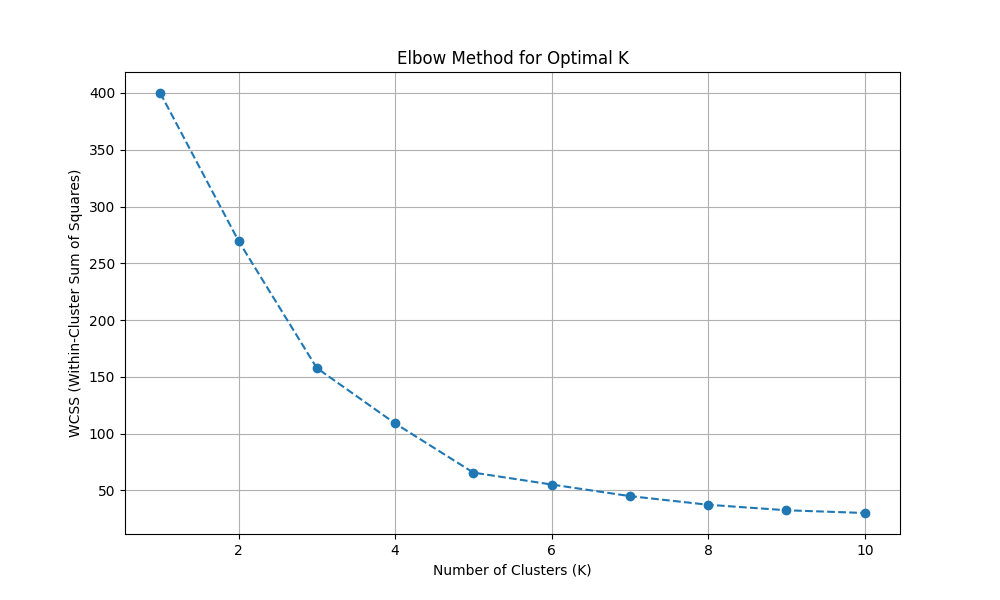
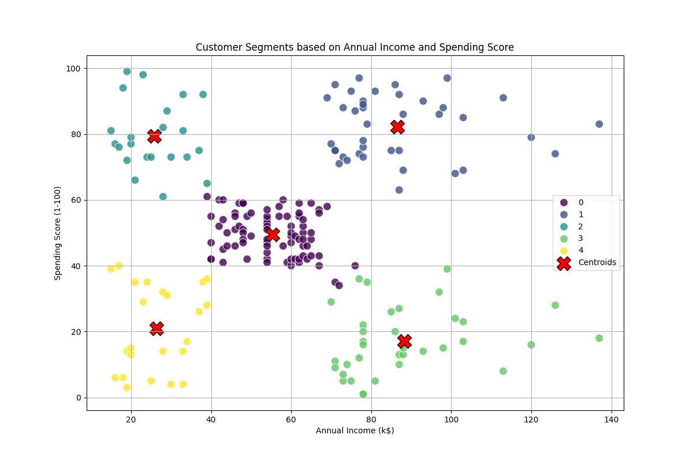

# 🎯 Advanced Customer Segmentation Analytics

[](https://www.python.org/)
[](https://scikit-learn.org/)
[](https://numpy.org/)
[](https://pandas.pydata.org/)
[](https://opensource.org/licenses/MIT)

## 📊 Executive Summary

This sophisticated data analytics project leverages the power of K-means clustering algorithms to perform advanced customer segmentation analysis. By processing and analyzing mall customer data, we uncover distinct customer personas and behavioral patterns that can drive strategic business decisions.

## 🌟 Key Features

- **Advanced Clustering Analysis**: Implementation of K-means clustering algorithm
- **Dynamic Visualization**: Interactive plots showcasing customer segments
- **Automated Optimization**: Elbow method implementation for optimal cluster determination
- **Comprehensive Data Processing**: Robust handling of demographic and behavioral data
- **Statistical Validation**: thorough validation of clustering results

## 🎯 Business Impact

- Identify high-value customer segments
- Optimize marketing strategies
- Enhance customer targeting
- Improve resource allocation
- Drive data-driven decision making

## 🔧 Technical Architecture

### Prerequisites
```plaintext
Python >= 3.13
NumPy >= 2.3.1
Pandas >= 2.3.1
Scikit-learn >= 1.7.1
Matplotlib >= 3.10.3
Seaborn >= 0.13.2
```

### Dataset Features
| Feature | Description | Type |
|---------|-------------|------|
| CustomerID | Unique identifier | Integer |
| Gender | Customer's gender | Categorical |
| Age | Customer's age | Numerical |
| Annual Income | Yearly income (k$) | Numerical |
| Spending Score | Spending behavior (1-100) | Numerical |

## 🚀 Quick Start

### Installation

```bash
# Clone the repository
git clone https://github.com/yourusername/customer-segmentation.git
cd customer-segmentation

# Create virtual environment
python -m venv myenv

# Activate virtual environment
# Windows:
myenv\Scripts\activate
# Unix/MacOS:
source myenv/bin/activate

# Install dependencies
pip install -r requirements.txt
```

### Execution

```bash
python k-means.py
```

## 📈 Results & Visualization

### Elbow Method Analysis

*Optimal cluster determination using the elbow method*

### Customer Segmentation

*Visual representation of identified customer segments*

## 📂 Project Structure

```plaintext
customer-segmentation/
│
├── k-means.py              # Main analysis script
├── Mall_Customers.csv      # Source dataset
├── requirements.txt        # Project dependencies
├── .gitignore             # Git ignore rules
│
├── outputs/
│   ├── elbow_method_plot.png    # Elbow curve visualization
│   └── customer_segments_plot.png # Segment visualization
│
└── README.md              # Project documentation
```

## 📊 Analysis Workflow

1. **Data Preprocessing**
   - Data cleaning and normalization
   - Feature scaling and transformation
   - Missing value handling

2. **Clustering Analysis**
   - Optimal cluster determination
   - K-means implementation
   - Cluster validation

3. **Visualization**
   - Interactive plots generation
   - Segment analysis
   - Pattern identification

## 🤝 Contributing

We welcome contributions to enhance this analysis! Please follow these steps:

1. Fork the repository
2. Create your feature branch (`git checkout -b feature/AmazingFeature`)
3. Commit your changes (`git commit -m 'Add some AmazingFeature'`)
4. Push to the branch (`git push origin feature/AmazingFeature`)
5. Open a Pull Request

## 📜 License

This project is licensed under the MIT License - see the [LICENSE](LICENSE) file for details.

## 📫 Contact

For any queries or collaborations, please reach out:

- Project Link: [https://github.com/KeshavxGupta/SCT_ML_2.git](https://github.com/KeshavxGupta/SCL_ML_2)

## 🙏 Acknowledgments

- Mall Customer Dataset providers
- Contributors to the scikit-learn library
- Data Science community for valuable insights

---
⭐ Found this project useful? Please consider giving it a star!
